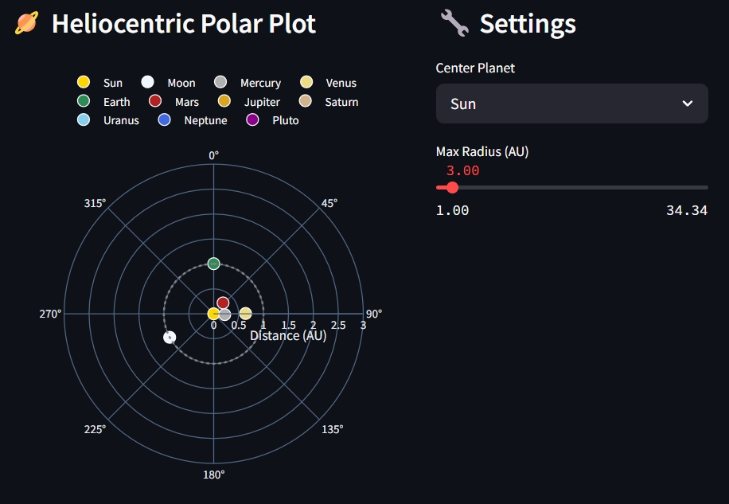

# 🌌 Constellation‑Playground

> _An experimental project built to learn how to integrate 3rd‑party APIs, work with Streamlit, and explore basic data visualization techniques._

---

## 🚀 Features

- 📍 **Location Autocomplete** via Google Places API  
- 📅 **Date Picker** for choosing any night in history or future  
- 🌠 **Constellation Star Charts** powered by AstronomyAPI  
- 🔭 **Interactive Polar Plots** of planet positions  
- 🪐 **Moon Phase & Planetary Positions** tabs (coming soon)  

---

## 🎯 Learning Goals

1. **API Integration**: Handling OAuth/basic auth, GET/POST, error handling  
1. **State Management**: Using `st.session_state` in Streamlit  
1. **Data Parsing & Visualization**: JSON → pandas → Plotly/Matplotlib  
1. **UI/UX**: Designing a responsive, two‑column layout in Streamlit  

---

## 🖼️ Screenshots

  
*star‑chart of selected constellation*  

  
*Heliocentric polar plot, zoomable via slider*  

---

## 📦 Getting Started (Running Locally)

### 1. Clone

```bash
git clone https://github.com/yourusername/constellation-playground.git
cd constellation-playground
```

### 2. Create a .env

```bash
APP_ID=your_astronomyapi_app_id
APP_SECRET=your_astronomyapi_app_secret
GOOGLE_API_KEY=your_google_maps_api_key
```

### 3. Install requirements.txt

```bash
pip install -r requirements.txt
```

### 4. Run streamlit program

```bash
streamlit run streamlit_constellation_map.py #Default
streamlit run streamlit_constellation_map.py --server.headless true --server.fileWatcherType=poll # Helps show updates on save, avoid popping new tabs each time command is ran
```
